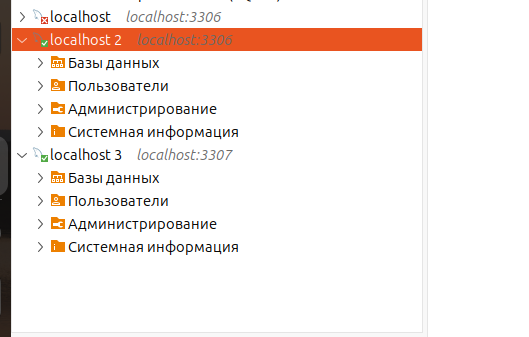

# Домашнее задание к занятию «Index» Шелухин Юрий

### Задание 1.

На лекции рассматривались режимы репликации master-slave, master-master, опишите их различия.

*Ответить в свободной форме.*

 ---

#### Решение.

1. Master-Slave:  
    
Один источник данных (Master), который обрабатывает все операции записи и чтения, один или несколько Slave (ведомых) серверов постоянно копируют (реплицируют) все данные с Master'а.
Slave-серверы обычно используются только для операций чтения. Все запросы на запись (INSERT, UPDATE, DELETE) отправляются строго на Master. Изменения с Master'а асинхронно (или полусинхронно) применяются на Slave'ах.

Преимущества:  
-масштабирование чтения: можно добавлять множество Slave-серверов, чтобы распределить нагрузку от тяжелых запросов на чтение (отчеты, аналитика);
-повышение доступности и отказоустойчивости: Если Master падает, один из Slave'ов может быть повышен  до роли нового Master'а (требует дополнительных действий администратора или оркестратора).  

Недостатки:  
-единая точка отказа: До тех пор пока не произведено переключение, Master является единой точкой отказа для операций записи;  
-задержка репликации (Replication Lag): Slave'ы всегда немного отстают от Master'а. Это может привести к тому, что прочитанные с Slave'а данные будут не самыми свежими (eventual consistency).
-запись не масштабируется: Все операции записи по-прежнему идут на один сервер.  

2. Master-Master:  
   
В этой модели несколько серверов являются равноправными, каждый Master может принимать операции как на запись, так и на чтение. Изменения данных (записи), сделанные на одном Master'е, реплицируются на все остальные Master'ы.  

Преимущества:  
-высокая доступность для записи: Если один Master падает, другие продолжают принимать запросы на запись. Нет единой точки отказа;  
-масштабирование как чтения, так и записи: Нагрузку на запись можно распределить между несколькими серверами;
-географическое распределение: Можно разместить Master'ы в разных дата-центрах для более быстрого отклика пользователям в разных регионах.  

Недостатки:  
-конфликты репликации: если два разных клиента изменят одну и ту же строку данных на двух разных Master'ах одновременно, возникнет конфликт. Разрешение таких конфликтов — сложная задача (например, "победит" последняя запись, или запись с определенным ID);
-высокая сложность: Настройка, поддержка и диагностика такой системы гораздо сложнее.
-риск потери данных: При неправильном разрешении конфликтов можно потерять данные.

---
 

### Задание 2.

Выполните конфигурацию master-slave репликации, примером можно пользоваться из лекции.

*Приложите скриншоты конфигурации, выполнения работы: состояния и режимы работы серверов.*

---

#### Решение.

Выполним запрос для по условию задания.

`EXPLAIN ANALYZE
se5-07-30'
	and p.payment_date = r.rental_date
	and r.customer_id = c.customer_id
	and i.inventory_id = r.inventory_id;`   

Получим плохие результаты:  
(cost=2.5..2.5 rows=0) - оценка оптимизатора - Очень низкая стоимость (от начала до конца операции), 
rows=0: Оптимизатор ожидал 0 строк - это указывает на проблему с оценкой кардинальности.  

(actual time=4953..4953 rows=391 loops=1) - реальные показатели.  
actual time=4953..4953: Операция заняла ~4.95 секунд, rows=391: Фактически вернулось 391 строка, loops=1: Операция выполнилась один раз.

Проблемы: ожидалось 0 строк, получено - 391, 4.95 секунды для обработки всего 391 строки - это очень медленно.
Временная таблица создает значительные накладные расходы.

В запросе присутствуют узкие места:  
Отсутствие JOIN с film.	Таблица film не соединена с другими, создает декартово произведение	и резкий рост  обрабатываемых строк.  
Использование функции DATE(p.payment_date) обходит индексы.  
Полное сканирование таблицы (Seq Scan) вместо поиска по индексу.  
DISTINCT пытается удалить дубликаты после расчета SUM() OVER, что создает	избыточные вычисления и необходимость во временной таблице.

Создадим индексы
`CREATE INDEX idx_payment_date ON payment(payment_date);
CREATE INDEX idx_rental_rental_date ON rental(rental_date);
CREATE INDEX idx_rental_customer_id ON rental(customer_id);
CREATE INDEX idx_inventory_id ON inventory(inventory_id);
CREATE INDEX idx_film_id ON film(film_id);`

Модифицируем запрос и проанализируем его.   

`EXPLAIN ANALYZE
SELECT 
    CONCAT(c.last_name, ' ', c.first_name) AS customer_name,
    f.title AS film_title,
    SUM(p.amount) AS total_payment
FROM 
    payment p
INNER JOIN rental r ON p.rental_id = r.rental_id
INNER JOIN customer c ON r.customer_id = c.customer_id
INNER JOIN inventory i ON r.inventory_id = i.inventory_id
INNER JOIN film f ON i.film_id = f.film_id
WHERE 
    p.payment_date >= '2005-07-30' AND p.payment_date < '2005-07-31'
GROUP BY 
    c.customer_id, c.last_name, c.first_name, f.film_id, f.title;`

 Время выполнения сократилось в 45 раз.  

 

---

### Задание 3*.

Выполните конфигурацию master-master репликации. Произведите проверку.

*Приложите скриншоты конфигурации, выполнения работы: состояния и режимы работы серверов.*

---

#### Решение.

PostgreSQL предлагает богатый набор специализированных типов индексов, которые отсутствуют в MySQL и позволяют эффективно работать со сложными данными и специфичными запросами, например:  
GIN - Generalized Inverted Index (Обобщенный обратный индекс). Полнотекстовый поиск, массивы, JSON-данные (jsonb), сложные типы данных.  
GiST - Generalized Search Tree (Обобщенное дерево поиска). Геометрические данные, географические объекты, диапазоны, полнотекстовый поиск. Может быть расширен для поддержки пользовательских типов данных.  
SP-GiST - Space-Partitioned GiST (Пространственно-разделенный GiST). Эффективная индексация неоднородных данных с пространственным разделением, таких как деревья квадрантов (quad-trees) или k-D деревья.  
BRIN - Block Range Index (Индекс диапазонов блоков). Очень большие таблицы, где данные физически упорядочены (например, данные временных рядов). Занимает значительно меньше места, чем B-Tree.  
Hash - Хэш-индекс. Точное сравнение, в современных версиях PostgreSQL безопасен для использования.

MySQL в основном опирается на B-Tree (и его вариации) и R-Tree (для пространственных данных), но не имеет аналогов перечисленным выше специализированным индексам PostgreSQL.  

---

