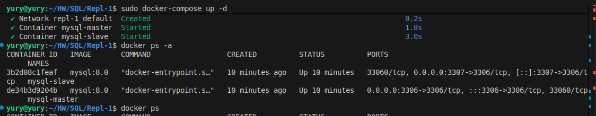

# Домашнее задание к занятию «Index» Шелухин Юрий

### Задание 1.

На лекции рассматривались режимы репликации master-slave, master-master, опишите их различия.

*Ответить в свободной форме.*

 ---

#### Решение.

1. Master-Slave:  
    
Один источник данных (Master), который обрабатывает все операции записи и чтения, один или несколько Slave (ведомых) серверов постоянно копируют (реплицируют) все данные с Master'а.
Slave-серверы обычно используются только для операций чтения. Все запросы на запись (INSERT, UPDATE, DELETE) отправляются строго на Master. Изменения с Master'а асинхронно (или полусинхронно) применяются на Slave'ах.

Преимущества:  
-масштабирование чтения: можно добавлять множество Slave-серверов, чтобы распределить нагрузку от тяжелых запросов на чтение (отчеты, аналитика);
-повышение доступности и отказоустойчивости: Если Master падает, один из Slave'ов может быть повышен  до роли нового Master'а (требует дополнительных действий администратора или оркестратора).  

Недостатки:  
-единая точка отказа: До тех пор пока не произведено переключение, Master является единой точкой отказа для операций записи;  
-задержка репликации (Replication Lag): Slave'ы всегда немного отстают от Master'а. Это может привести к тому, что прочитанные с Slave'а данные будут не самыми свежими (eventual consistency).
-запись не масштабируется: Все операции записи по-прежнему идут на один сервер.  

2. Master-Master:  
   
В этой модели несколько серверов являются равноправными, каждый Master может принимать операции как на запись, так и на чтение. Изменения данных (записи), сделанные на одном Master'е, реплицируются на все остальные Master'ы.  

Преимущества:  
-высокая доступность для записи: Если один Master падает, другие продолжают принимать запросы на запись. Нет единой точки отказа;  
-масштабирование как чтения, так и записи: Нагрузку на запись можно распределить между несколькими серверами;
-географическое распределение: Можно разместить Master'ы в разных дата-центрах для более быстрого отклика пользователям в разных регионах.  

Недостатки:  
-конфликты репликации: если два разных клиента изменят одну и ту же строку данных на двух разных Master'ах одновременно, возникнет конфликт. Разрешение таких конфликтов — сложная задача (например, "победит" последняя запись, или запись с определенным ID);
-высокая сложность: Настройка, поддержка и диагностика такой системы гораздо сложнее.
-риск потери данных: При неправильном разрешении конфликтов можно потерять данные.

---
 

### Задание 2.

Выполните конфигурацию master-slave репликации, примером можно пользоваться из лекции.

*Приложите скриншоты конфигурации, выполнения работы: состояния и режимы работы серверов.*

---

#### Решение.

Выполним конфигурацию с использованием docker-compose.

Подключимся чере Dbeaver (порты 3306 и 3307).  

Дадим названия (master, slave). Создадим на master базу тест, затем обновим slave для проверки репликации.  

   

Проверим статусы.

    
  

---

### Задание 3*.

Выполните конфигурацию master-master репликации. Произведите проверку.

*Приложите скриншоты конфигурации, выполнения работы: состояния и режимы работы серверов.*

---

#### Решение.

Выполним конфигурацию с использованием docker-compose.

Подключимся чере Dbeaver (порты 3306 и 3307).  

Переименуем (master_1, master_2). Создадим на master_1 базу тест-1, затем на master_2 базу тест-2, обновим для проверки репликации. Проверим статусы.  

   
  

---

